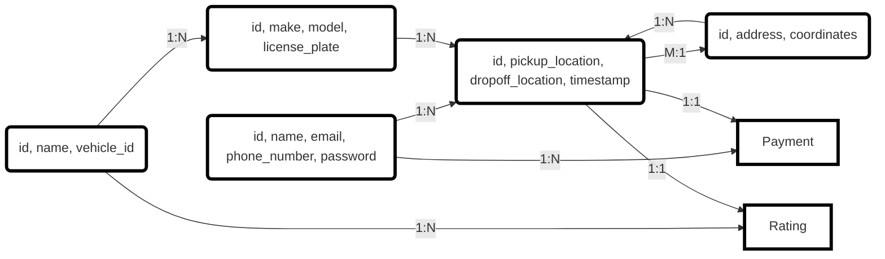

## ERD

```mermaid
graph LR
    User(id, name, email, phone_number, password) -->|1:N|Ride
    Driver(id, name, vehicle_id) -->|1:N|Vehicle
    Vehicle(id, make, model, license_plate) -->|1:N|Ride
    Ride(id, pickup_location, dropoff_location, timestamp) -->|M:1|Location
    Location(id, address, coordinates) -->|1:N|Ride
    User -->|1:N|Payment
    Ride -->|1:1|Payment
    Driver -->|1:N|Rating
    Ride -->|1:1|Rating
    style User fill:#fff,stroke:#000,stroke-width:4px
    style Driver fill:#fff,stroke:#000,stroke-width:4px
    style Vehicle fill:#fff,stroke:#000,stroke-width:4px
    style Ride fill:#fff,stroke:#000,stroke-width:4px
    style Location fill:#fff,stroke:#000,stroke-width:4px
    style Payment fill:#fff,stroke:#000,stroke-width:4px
    style Rating fill:#fff,stroke:#000,stroke-width:4px

```
